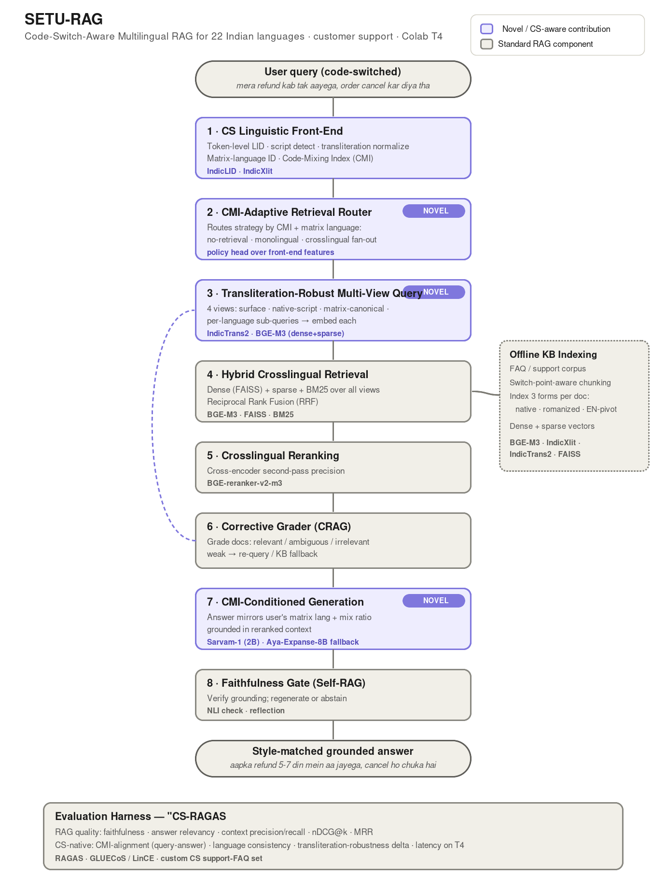
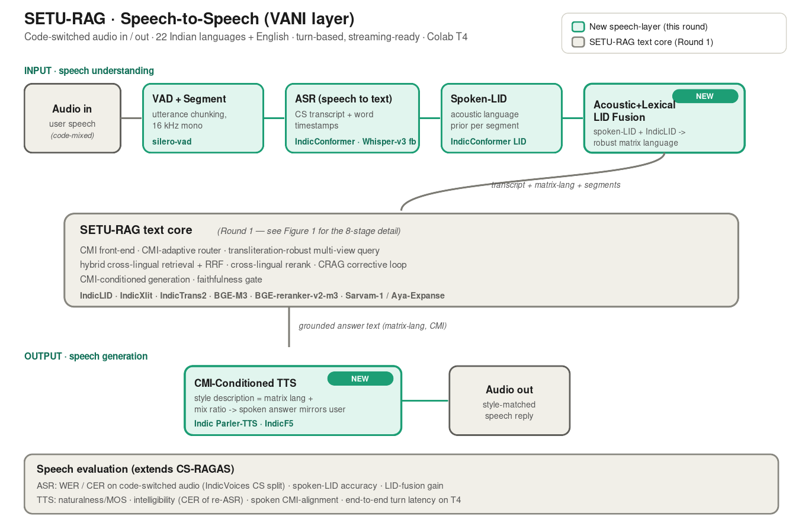

# SETU-RAG — Code-Switch-Aware Multilingual RAG

A retrieval-augmented customer-support assistant for **code-switched** queries across
the **22 scheduled languages of India**, designed to run on a single **Google Colab T4 (16 GB)**.
"SETU" (सेतु, *bridge*) reflects the goal: bridging languages, scripts, and registers inside one RAG pipeline.

> MTech CS dissertation project. **It runs end-to-end on a Colab T4** — `build_pipeline()` loads real
> open-source models (BGE-M3, BGE-reranker-v2-m3, a 4-bit instruct LLM) and answers code-switched
> queries. Every model has a graceful fallback, so the pipeline also runs offline/CPU (with stand-in
> models) for testing. The AI4Bharat front-end pieces (IndicLID/IndicXlit/IndicTrans2) are optional
> drop-ins that enhance the native-script views when installed.

## The three novel contributions

1. **CMI-Adaptive Retrieval Router** (`setu_rag/router/adaptive_router.py`) — routes the retrieval
   strategy by the query's *Code-Mixing Index* and *matrix language*, not by reasoning complexity.
   Monolingual queries stay cheap; genuinely code-mixed queries trigger a crosslingual fan-out.
2. **Transliteration-Robust Multi-View Query** (`setu_rag/query/multi_view.py`) — expands a query into
   surface / native-script / matrix-canonical / English-pivot views so at least one matches the KB
   regardless of script. Directly targets the documented failure of retrievers on code-switched input.
3. **CMI-Conditioned Generation** (`setu_rag/generation/generator.py`) — conditions the answer on the
   user's measured matrix language and mix ratio so the reply mirrors their register (Hinglish in →
   Hinglish out), while staying grounded in retrieved context.

Plus a **CS-RAGAS** evaluation harness (`setu_rag/eval/`) combining RAGAS quality metrics with
CS-native metrics (CMI-alignment, language-consistency, transliteration-robustness).

## Architecture



```
query → front-end (LID · translit-normalise · CMI · matrix lang)
      → CMI-adaptive router            [novel #1]
      → transliteration-robust views   [novel #2]
      → hybrid crosslingual retrieval (BGE-M3 dense+sparse + BM25) → RRF
      → crosslingual rerank (BGE-reranker-v2-m3)
      → CRAG grade  ──weak──▶ corrective re-query (loop)
      → CMI-conditioned generation (Sarvam-1 / Aya-Expanse-8B)  [novel #3]
      → faithfulness gate (Self-RAG / mDeBERTa-NLI)
      → style-matched grounded answer
```

## Open-source models per step

| Step | Model | Why |
|------|-------|-----|
| Token LID (native + romanized) | `ai4bharat/IndicLID` | Only LID covering all 22 langs incl. romanized |
| Transliteration | `ai4bharat/indicxlit` | Roman↔native, 21 langs, ~11M params |
| Translation / query expansion | `ai4bharat/indictrans2-*-dist-200M` | 22-lang MT, distilled to fit T4 |
| Embeddings | `BAAI/bge-m3` | Dense+sparse+ColBERT in one pass, MIT, 100+ langs |
| Reranker | `BAAI/bge-reranker-v2-m3` | Multilingual cross-encoder |
| Generator (primary) | `sarvamai/sarvam-1` (2B) | Indic-specialised, efficient tokenizer, fast on T4 |
| Generator (fallback) | `CohereForAI/aya-expanse-8b` | Broad Indic coverage, 4-bit on T4 |
| Faithfulness NLI | `MoritzLaurer/mDeBERTa-v3-base-xnli-...` | Small multilingual entailment judge |

## Repo layout

```
setu-rag/
├── README.md  requirements.txt  config.yaml
├── docs/                      architecture.svg / .png
├── data/                      faqs.sample.jsonl  eval.sample.jsonl
├── scripts/                   build_index.py  serve.py  serve_voice.py  run_eval.py
├── notebooks/                 setu_rag_colab.ipynb
└── setu_rag/
    ├── config.py              model registry · 22-lang table · T4 settings
    ├── pipeline.py            end-to-end orchestration
    ├── front_end/             language_id.py · transliterate.py · translate.py · cmi.py
    ├── router/                adaptive_router.py        [novel #1]
    ├── query/                 multi_view.py             [novel #2]
    ├── retrieval/             embedder.py · index.py (RRF) · kb_ingest.py
    ├── rerank/                reranker.py
    ├── correction/            crag.py
    ├── generation/            generator.py [novel #3] · faithfulness.py
    └── eval/                  cs_metrics.py · ragas_eval.py · run_eval.py
```

## Quickstart (Colab T4)

```bash
pip install -r colab_requirements.txt      # minimal, un-gated, pip-installable
python scripts/build_index.py              # builds the index + answers sample queries (real models)
python scripts/build_index.py --offline    # same, with stand-in models (no GPU / no downloads)
```
```python
# or from Python / a notebook:
from setu_rag.app import build_pipeline
rag = build_pipeline()                      # loads sample FAQs, real models on GPU
print(rag.answer("mera refund kab tak aayega").answer)
```
The fastest path on Colab is **[`notebooks/setu_rag.ipynb`](notebooks/setu_rag.ipynb) → Runtime → Run all** — it clones the repo, installs deps, builds the pipeline, opens a Gradio mic/upload UI for speech-to-speech, and runs the eval table.

Bring the AI4Bharat front-end fully alive (each is real-with-fallback — installs enhance
retrieval, absence degrades gracefully):
```bash
pip install ai4bharat-transliteration                 # IndicXlit native-script view
pip install git+https://github.com/AI4Bharat/IndicLID.git   # token LID (all 22 langs, romanized)
pip install IndicTransToolkit                          # IndicTrans2 pivots (+ accept model licenses)
```
```python
from setu_rag.app import build_pipeline
rag = build_pipeline(enable_translation=True)          # turns on the English-pivot / matrix-canonical views
```
Run the CS-RAGAS evaluation table over the sample code-switched pairs:
```bash
python scripts/run_eval.py --offline   # deterministic, no downloads
python scripts/run_eval.py             # real models if available
```

**Running on Colab?** See [`COLAB.md`](COLAB.md) — pick a T4 GPU and open `notebooks/setu_rag_colab_run.ipynb` → Run all. No HF token needed for the core text pipeline.

**Running on Kaggle?** See [`KAGGLE.md`](KAGGLE.md) — turn Internet **On**, add the code as a Dataset (or git clone), set an `HF_TOKEN` secret, and you get 2× T4 (32 GB). Notebook: `notebooks/setu_rag_kaggle.ipynb`.

Every model wrapper is **real-with-fallback** — no stubs to fill. With the deps + a GPU it loads
the real model; offline/CPU (or `force_offline=True`) it uses a deterministic stand-in so the whole
pipeline still runs. The AI4Bharat front-end (IndicLID, IndicXlit, IndicTrans2) and the speech ASR
(IndicConformer → Whisper) are wired the same way: install to upgrade, skip to degrade gracefully.

## T4 memory policy

BGE-M3 (~2.3 GB fp16) and the reranker (~2.3 GB) load on demand; FAISS stays on CPU; IndicTrans2 uses
the distilled 200M variants; the generator runs 4-bit (Sarvam-1 ≈ 1.5–2 GB). Heavy models are freed
between stages so peak VRAM stays under 16 GB.
```
```
## License / attribution
All models above are open-source (check each model card: BGE = MIT; Sarvam/IndicTrans2/IndicLID per their
licenses; Aya-Expanse under CC-BY-NC — swap for Gemma/Qwen if you need a commercial-friendly fallback).

---

## Speech-to-Speech extension (VANI layer)

SETU-RAG now accepts **audio in 22 Indian languages + English (code-switched)** and replies with
**style-matched audio**. The VANI layer wraps the text core: ASR in front, CMI-conditioned TTS behind.



### New stages — one Python file each

```
setu_rag/speech/
├── audio_io.py      load / resample / save  (16 kHz mono contract)
├── vad.py           silero-vad segmentation (turn-based, streaming-ready)
├── asr.py           IndicConformer (Whisper-v3-turbo fallback) -> transcript + timestamps
├── spoken_lid.py    acoustic language posterior
├── lid_fusion.py    acoustic + lexical LID fusion        [speech novelty #1]
└── tts.py           CMI-conditioned Indic Parler-TTS      [speech novelty #2]
setu_rag/speech_pipeline.py   SpeechSetuRAG: audio -> text core -> audio
setu_rag/eval/speech_metrics.py   WER / CER / spoken-LID acc / TTS intelligibility
scripts/serve_voice.py        Gradio mic-in / audio-out demo
notebooks/setu_rag_speech_colab.ipynb
```

### Open-source models per speech stage

| Stage | Model | Notes |
|-------|-------|-------|
| VAD | `snakers4/silero-vad` | tiny, CPU |
| ASR | `ai4bharat/indic-conformer-600m-multilingual` | 22 langs, trained on IndicVoices (incl. code-switched) |
| ASR fallback | `openai/whisper-large-v3-turbo` | general baseline |
| Spoken-LID | IndicConformer LID head | acoustic language prior |
| TTS | `ai4bharat/indic-parler-tts` | 21 langs, code-mixing, description-controllable |
| TTS (HQ) | `ai4bharat/IndicF5` | near-human, 11 langs |

### Run the voice demo

```bash
pip install -r requirements.txt      # + parler-tts and IndicConformer from GitHub (see notes)
python scripts/serve_voice.py
```

### T4 note
Speech models load **on demand and are freed between stages** (ASR → text core → TTS run
sequentially in a turn), so the added ASR (~1.3 GB) and TTS (~1–2 GB) never coexist with the
generator. Streaming is left as a structured extension (VAD/ASR already expose chunk hooks).
